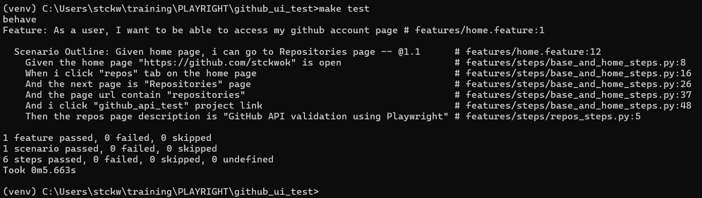

# github_ui_test

UI tests using Behavior-driven development (BDD) framework with Playwright and python

Note: Github Action is used for implementing CI/CD workflows defined in .github/workflows/main.yml

**Steps**

1. clone repos
2. execute 'python -m venv venv' to create virtual env
3. activate venv
4. make install_win when running in Windows
5. make test to execute

**Results**

~                                                
